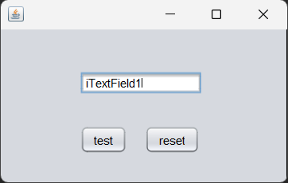
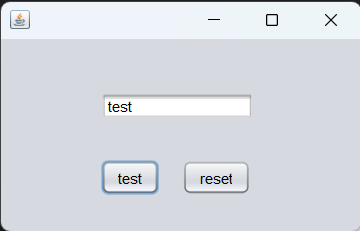
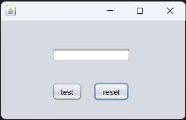
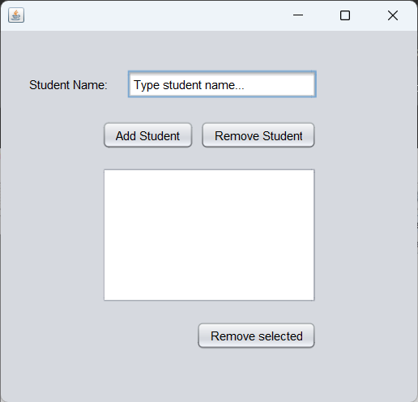
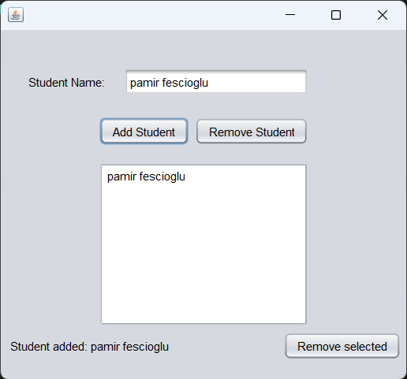
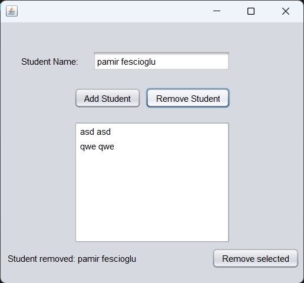
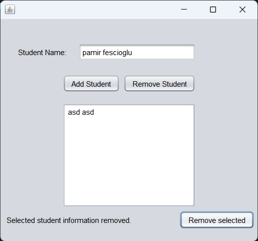

# java-tutorial
This repository includes my Java introductory training works.

I followed the program path [Java ile Programlamaya Giriş course](https://www.btkakademi.gov.tr/portal/course/java-ile-programlamaya-giris-9617) by Engin Demiroğ in BTK Akademi.

---

**Introduction to Java:**
1. [helloWorld](https://github.com/Pamirus/java-tutorial/blob/main/introduction-to-java/helloWorld.java)
2. [variables](https://github.com/Pamirus/java-tutorial/blob/main/introduction-to-java/variables.java)
3. [dataTypes](https://github.com/Pamirus/java-tutorial/blob/main/introduction-to-java/dataTypes.java)
4. [conditionalStatements](https://github.com/Pamirus/java-tutorial/blob/main/introduction-to-java/conditionalStatements.java)
5. [conditionalStatementsDemo](https://github.com/Pamirus/java-tutorial/blob/main/introduction-to-java/conditionalStatementsDemo.java)
6. [switchStatements](https://github.com/Pamirus/java-tutorial/blob/main/introduction-to-java/switchStatements.java)
7. [forLoops](https://github.com/Pamirus/java-tutorial/blob/main/introduction-to-java/forLoops.java)
8. [whileLoops](https://github.com/Pamirus/java-tutorial/blob/main/introduction-to-java/whileLoops.java)
9. [doWhileLoops](https://github.com/Pamirus/java-tutorial/blob/main/introduction-to-java/doWhileLoops.java)
10. [arrays](https://github.com/Pamirus/java-tutorial/blob/main/introduction-to-java/arrays.java)
11. [arraysDemo](https://github.com/Pamirus/java-tutorial/blob/main/introduction-to-java/arraysDemo.java)
12. [multiDimensionalArrays](https://github.com/Pamirus/java-tutorial/blob/main/introduction-to-java/multiDimensionalArrays.java)
13. [strings](https://github.com/Pamirus/java-tutorial/blob/main/introduction-to-java/strings.java)

**Mini-Projects in Java:**
1. [primeNumber](https://github.com/Pamirus/java-tutorial/blob/main/mini-projects/primeNumber.java)
2. [lowOrThinVowelChar](https://github.com/Pamirus/java-tutorial/blob/main/mini-projects/lowOrThinVowelChar.java)
3. [perfectNumber](https://github.com/Pamirus/java-tutorial/blob/main/mini-projects/perfectNumber.java)
4. [friendNumbers](https://github.com/Pamirus/java-tutorial/blob/main/mini-projects/friendNumbers.java)
5. [findNumber](https://github.com/Pamirus/java-tutorial/blob/main/mini-projects/findNumber.java)

**Object Oriented Programming in Java:**
1. [methods](https://github.com/Pamirus/java-tutorial/tree/main/oop-in-java/methods)
    1. [Methods](https://github.com/Pamirus/java-tutorial/blob/main/oop-in-java/methods/Methods.java)
    2. [MethodsVariableArguments](https://github.com/Pamirus/java-tutorial/blob/main/oop-in-java/methods/MethodsVariableArguments.java)
2. [class](https://github.com/Pamirus/java-tutorial/tree/main/oop-in-java/class)
    * Classes define the blueprints for objects (instances). A class is a structure that contains properties (fields) and behaviors (methods).
3. [classDemo](https://github.com/Pamirus/java-tutorial/tree/main/oop-in-java/classDemo)
4. [classesWithAttributes](https://github.com/Pamirus/java-tutorial/tree/main/oop-in-java/classesWithAttributes)
5. [encapsulation](https://github.com/Pamirus/java-tutorial/tree/main/oop-in-java/encapsulation)
    * Encapsulation involves grouping the data and methods that manipulate the data within a single unit. Encapsulation restricts the access to certain components, enhancing security and maintainability. 
6. [constructors](https://github.com/Pamirus/java-tutorial/tree/main/oop-in-java/construction)
    * Constructors are methods which are called when an object is created. The constructors are usually used to initialise the fields of a class or perform some initial operations.
7. [methodOverloading](https://github.com/Pamirus/java-tutorial/tree/main/oop-in-java/methodOverloading)
8. [inheritance](https://github.com/Pamirus/java-tutorial/tree/main/oop-in-java/inheritance)
    * The inheritance allows a class to inherit properties and behaviours from another class, promotes the reusability of code.
9. [inheritanceDemo](https://github.com/Pamirus/java-tutorial/blob/main/oop-in-java/inheritanceDemo)
10. [polymorphism](https://github.com/Pamirus/java-tutorial/blob/main/oop-in-java/polymorphism)
    * There are two types of polymorphism in OOP. Compile-time and run-time polymorphism. 

      Compile-time polymorphism is overloading, which is made with the same-named method, but has a different parameter list. Return type conversion cannot be done with the same parameter list since the signature of the methods will be the same due to the same parameter list.

      The return type cannot be changed with the same parameter list by overloading. Because the signatures of the methods would be exactly the same with the same parameter list.

      Run-time polymorphism is overriding, which is made with the same-named base class method in the derived class. The overridden method has the same parameter list. However, it allows us to make different operations.
11. [overriding](https://github.com/Pamirus/java-tutorial/blob/main/oop-in-java/overriding)
12. [abstractClasses](https://github.com/Pamirus/java-tutorial/blob/main/oop-in-java/abstractClasses)
    * Abstract classes cannot be instantiated on their own.

      Abstract classes may contain abstract methods. Subclasses that extend an abstract class must provide implementations for all the abstract methods or be declared as abstract classes themselves.

      Abstract classes are often used to define a common interface or behavior that multiple subclasses share. They provide a way to partially implement a class and leave some methods for the subclasses to implement based on their specific needs.
13. [abstractClassesDemo](https://github.com/Pamirus/java-tutorial/blob/main/oop-in-java/abstractClassesDemo)
14. [interfaces](https://github.com/Pamirus/java-tutorial/blob/main/oop-in-java/interfaces)
    * Interfaces define a contract that a class must implement, specifying which methods should be included. Multiple implementation of the interfaces in one class is allowed.
15. [polymorphismWithInterfaces](https://github.com/Pamirus/java-tutorial/blob/main/oop-in-java/polymorphismWithInterfaces)
16. [interfaceDemo](https://github.com/Pamirus/java-tutorial/blob/main/oop-in-java/interfaceDemo)
17. [composition](https://github.com/Pamirus/java-tutorial/blob/main/oop-in-java/composition)
    * The static keyword is used to define class-level entities that are shared among all instances of the class. Static members can be called over the class directly, so the object is not necessary to call a static member. The static keyword is often used for the utility elements.

      The inner classes are used to organize code, enhance encapsulation, and logically group related classes together. However, the inner classes are not often used to prevent the violation of the single responsibility principle.

**Packages**

Packages are used to organize and structure classes and interfaces into different namespaces. It helps avoid naming conflicts and provides a hierarchical structure to the code. Packages also aid in creating modular and reusable code.
1. [packagesDemo](https://github.com/Pamirus/java-tutorial/blob/main/packages/packagesDemo)
2. [packageCreation](https://github.com/Pamirus/java-tutorial/blob/main/packages/packageCreation)

**Collections**

Collections refer to frameworks or interfaces that are used to store and manipulate groups of objects. They provide a way to work with groups of objects as a single unit.
1. [arrayList](https://github.com/Pamirus/java-tutorial/blob/main/collections/arrayList)
2. [typesafeArrayList](https://github.com/Pamirus/java-tutorial/blob/main/collections/typesafeArrayList)
3. [arrayListWithClasses](https://github.com/Pamirus/java-tutorial/blob/main/collections/arrayListWithClasses)
4. [hashMap](https://github.com/Pamirus/java-tutorial/blob/main/collections/hashMap)


**Exception Handling**

Exception handling refers to the mechanism that allows you to handle runtime errors or exceptional conditions that may occur during the execution of a program.
1. [exceptionHandling](https://github.com/Pamirus/java-tutorial/blob/main/exceptionHandling/exceptionHandling)
2. [readFileDemo](https://github.com/Pamirus/java-tutorial/blob/main/exceptionHandling/readFileDemo)
3. [throwDemo](https://github.com/Pamirus/java-tutorial/blob/main/exceptionHandling/throwDemo)
4. [customException](https://github.com/Pamirus/java-tutorial/blob/main/exceptionHandling/customException)

**File Operations**

File operations refer to performing various tasks related to handling files and directories using classes and methods provided by the Java I/O (Input/Output) API. These operations include tasks like reading from files, writing to files, creating directories, deleting files, checking file existence, and more.
1. [workingWithFiles](https://github.com/Pamirus/java-tutorial/blob/main/fileOperations/workingWithFiles)
2. [readFiles](https://github.com/Pamirus/java-tutorial/blob/main/fileOperations/readFiles)
3. [writeFiles](https://github.com/Pamirus/java-tutorial/blob/main/fileOperations/writeFiles)

**Generics**

Generics are used to create classes, interfaces, and methods that can work with any data type. They provide a way to make the code more flexible, reusable, and type-safe by allowing you to write classes and methods that can operate on a variety of data types without sacrificing type safety.
1. [generics](https://github.com/Pamirus/java-tutorial/blob/main/generics/generics)
2. [genericsDemo](https://github.com/Pamirus/java-tutorial/blob/main/generics/genericsDemo)
3. [genericMethods](https://github.com/Pamirus/java-tutorial/blob/main/generics/genericMethods)

**Threading**

Threading refers to the concurrent execution of two or more parts of a program, allowing tasks to run in parallel. Threads are the smallest unit of execution within a process and enable programs to perform multiple tasks simultaneously.
1. [threadingDemo](https://github.com/Pamirus/java-tutorial/blob/main/threading/threadingDemo)

**Database Programming with JDBC**

The Java Database Connectivity (JDBC) concept is an important aspect of Java programming to work with databases in Java applications.

*NOTE: The database connection with JDBC needs a JDBC driver. Thus, the driver was added to the "libs/" folder. The compile command may be used as follows.*

```cmd /c 'javac Main.java && java -cp ".;../lib/mysql-connector-j-8.0.33.jar" Main'```
1. [selectDemo](https://github.com/Pamirus/java-tutorial/blob/main/selectDemo)
2. [insertDemo](https://github.com/Pamirus/java-tutorial/blob/main/insertDemo)
3. [updateDemo](https://github.com/Pamirus/java-tutorial/blob/main/updateDemo)
4. [deleteDemo](https://github.com/Pamirus/java-tutorial/blob/main/deleteDemo)
---
**Programming GUI with Swing**

1. [swingDemo](https://github.com/Pamirus/java-tutorial/blob/main/programmingGUIWithSwing/swingDemo)
    
    Screenshots:
    
    
    
    
    
    
2. [jListDemo](https://github.com/Pamirus/java-tutorial/blob/main/programmingGUIWithSwing/jListDemo)
    
    Screenshots:

    
    
    
    
    
    
    
3. re*
